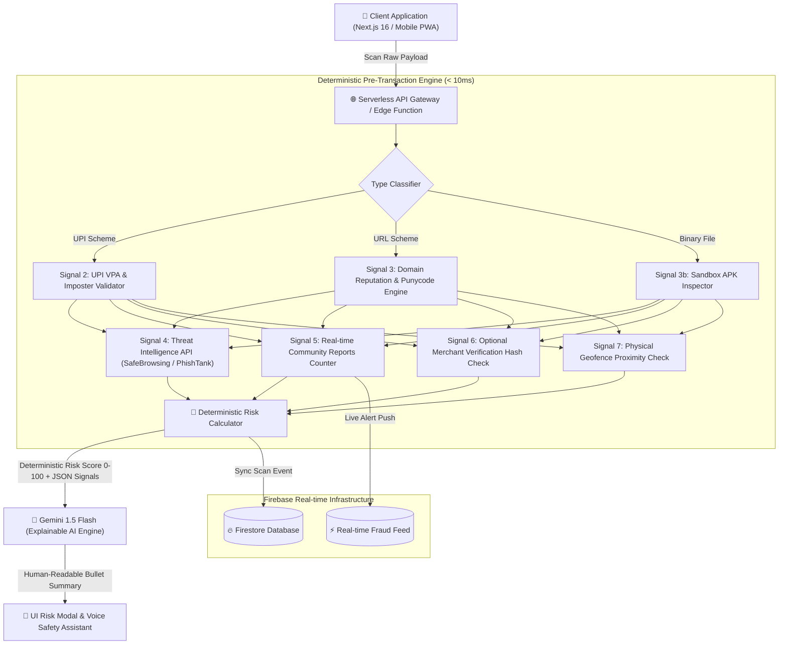

# 🏛️ SentinelQR — System Design Architecture & 16-Screen UI Wireframe Specification

> **Core Positioning**: SentinelQR is a **Pre-Transaction Payment Trust Engine** that evaluates QR payment destinations using multi-signal risk analysis and explainable AI before users authorize a transaction.

---

## 1. High-Level System Architecture (HLD)

SentinelQR adopts a **Strict Deterministic Core + Explainable AI (XAI)** architecture.



---

## 2. Multi-Signal Threat Engine & Confidence-Based Score Tiers

SentinelQR evaluates payment destinations deterministically to produce a score between **0 and 100**.

$$\text{Risk Score} = \min\left(100, \sum_{i=1}^{n} w_i \cdot s_i\right)$$

### 📡 The 7 Core Signal Vectors

| Signal | Category | Weight ($w_i$) | Description & Logic |
| :--- | :--- | :---: | :--- |
| **Signal 1** | **QR Type Identification** | Base | Categorizes raw string (`UPI`, `Website`, `APK`, `PDF`, `Wi-Fi`, `Contact`). |
| **Signal 2** | **UPI Validation** | +35 | Validates handle format, VPA structure, and imposter keywords (`support`, `refund`, `cashback`). |
| **Signal 3** | **Website Reputation** | +40 | Checks HTTP vs HTTPS (+20), Punycode homographs (+50), brand similarity distance (+40), shortener expansion (+25). |
| **Signal 4** | **Threat Intelligence** | +50 | Queries Google Safe Browsing, PhishTank, and local Redis threat cache. |
| **Signal 5** | **Community Intelligence** | +30 | Triggers when $\ge 5$ independent user reports flag the destination in 48 hours (+30 to +60 points). |
| **Signal 6** | **Merchant Verification *(Optional)*** | +70 | For enrolled merchants, compares scanned VPA/hash with stored baseline. Mismatch flags **QR sticker replacement**. |
| **Signal 7** | **Physical Context** | +20 | Geofence proximity validation (<100m radius matching registered merchant store GPS coordinates). |

### 📊 Confidence-Based Risk Score Tiers

| Risk Score | Tier Level | Action Guidance & Visual State |
| :---: | :--- | :--- |
| **0 – 29** | **🟢 Low Risk** | Low observed risk based on available signals. Safe to proceed with payment. |
| **30 – 69** | **🟡 Suspicious** | Suspicious indicators detected. Review domain/VPA details before proceeding. |
| **70 – 100** | **🔴 Critical Danger** | Multiple high-risk indicators detected. **Payment is not recommended.** |

---

## 3. Real-Time Firebase Database Architecture (Firestore Schemas)

### 3.1 `scans` Collection
```typescript
interface ScanDocument {
  id?: string;
  raw_payload: string;
  qr_type: "UPI_PAYMENT" | "WEBSITE_URL" | "APK_DOWNLOAD" | "UNKNOWN";
  risk_score: number; // 0 - 100
  risk_level: "SAFE" | "CAUTION" | "HIGH_RISK";
  signals: {
    is_upi: boolean;
    is_url: boolean;
    is_apk: boolean;
    is_https: boolean;
    is_shortened: boolean;
    brand_impersonation?: string;
    community_reports_count: number;
    sticker_tamper_detected?: boolean;
    unverified_vpa?: boolean;
  };
  user_uid: string;
  user_email: string;
  timestamp: Timestamp;
}
```

### 3.2 `merchants` Collection *(Optional Verification Layer)*
```typescript
interface MerchantDocument {
  merchant_id: string;
  business_name: string;
  official_vpa: string;
  qr_hash: string;
  location: {
    latitude: number;
    longitude: number;
  };
  verified_badge: boolean;
  registered_at: Timestamp;
}
```

### 3.3 `reports` Collection *(Community Intelligence)*
```typescript
interface FraudReportDocument {
  report_id?: string;
  raw_payload: string;
  category: "IMPOSTER_PAYMENT" | "PHISHING_URL" | "STICKER_TAMPER" | "OTHER";
  notes?: string;
  user_uid: string;
  user_email: string;
  timestamp: Timestamp;
  reports_count: number;
}
```

---

## 4. Complete 16-Screen Wireframe State Machine

SentinelQR features a seamless 16-screen user flow designed around modern Cyber Trust aesthetics:

```text
 ┌────────────────┐     ┌────────────────┐     ┌────────────────┐
 │ 01. Splash Screen│ ──► │02. Onboarding 1│ ──► │03. Onboarding 2│
 └────────────────┘     └────────────────┘     └────────────────┘
                                                        │
                                                        ▼
 ┌────────────────┐     ┌────────────────┐     ┌────────────────┐
 │ 06. Profile    │ ◄── │ 05. Main Home  │ ──► │04. Auth Sign-In│
 └────────────────┘     └───────┬────────┘     └────────────────┘
                                │
                                ▼
 ┌────────────────┐     ┌────────────────┐     ┌────────────────┐
 │09. Risk Modal  │ ◄── │08. Processing  │ ◄── │07. Scanner Reticle│
 └───────┬────────┘     └────────────────┘     └────────────────┘
         │
         ├──► 🟢 Safe Result (Green Card + Proceed to Payment)
         ├──► 🟡 Suspicious Result (Yellow Caution + Review Details)
         └──► 🔴 Critical Danger (Red Card + Fraud Block + Voice Shield)
                                │
                                ▼
 ┌────────────────┐     ┌────────────────┐     ┌────────────────┐
 │10. History Log │     │11. Community   │     │12. Report Scam │
 └────────────────┘     └────────────────┘     └────────────────┘
                                │
                                ▼
 ┌────────────────┐     ┌────────────────┐     ┌────────────────┐
 │13. Merchant Reg│     │14. Security Settings│15. Voice Assistant│
 └────────────────┘     └────────────────┘     └────────────────┘
```

---

## 5. Screen Wireframe Specifications

### Screen 07: Camera Viewfinder Reticle
- **Layout**: Full-bleed black camera feed with 4 Electric Cyan (`#00F2FE`) corner reticle brackets.
- **Controls**: Torch toggle button top-right, Gallery image import button top-left.
- **Micro-Animation**: Horizontal sweeping green/cyan laser line (`animate-sweep`).
- **HUD Indicator**: Live "Pre-Transaction Trust Engine Active" pulse pill.

### Screen 09: Risk Result Modal (Critical Danger State)
- **Top Badge**: Glowing Red Pill (`🔴 Risk Score: 82/100 — CRITICAL DANGER`).
- **Signal Breakdown Grid**:
  - Community Fraud Flags: 18 reports (`+30`)
  - Merchant Mismatch: QR sticker swap detected (`+20`)
  - Brand Impersonation: `paytm-secure-login.net` (`+20`)
  - Domain Registration: 4 days old (`+15`)
- **Gemini Explainable AI Summary**: Plain language explanation generated dynamically.
- **Voice Shield**: Floating Audio Button (`🔊 Read Safety Advice Aloud`).
- **Primary Actions**:
  - `🚫 Abort Payment & Exit` (Full Red CTA)
  - `🚨 Report to Community` (Outline Button)

---

## 6. The Bulletproof Hackathon Pitch Script

> **Q: "How does your AI know if a QR code is fake?"**  
> **A**: *"We don't claim to identify fake QR images. We decode the QR, analyze the destination using multiple measurable trust signals, calculate a deterministic risk score, and then use AI to explain the findings in plain language before the user decides whether to pay."*

> **Q: "What if the merchant never registers?"**  
> **A**: *"Merchant verification is an optional trust layer, not a single point of failure. If a merchant isn't enrolled, SentinelQR relies on the remaining trust signals—such as domain age, URL unrolling, UPI syntax validation, threat intelligence databases, and community reports—to assess destination risk."*
