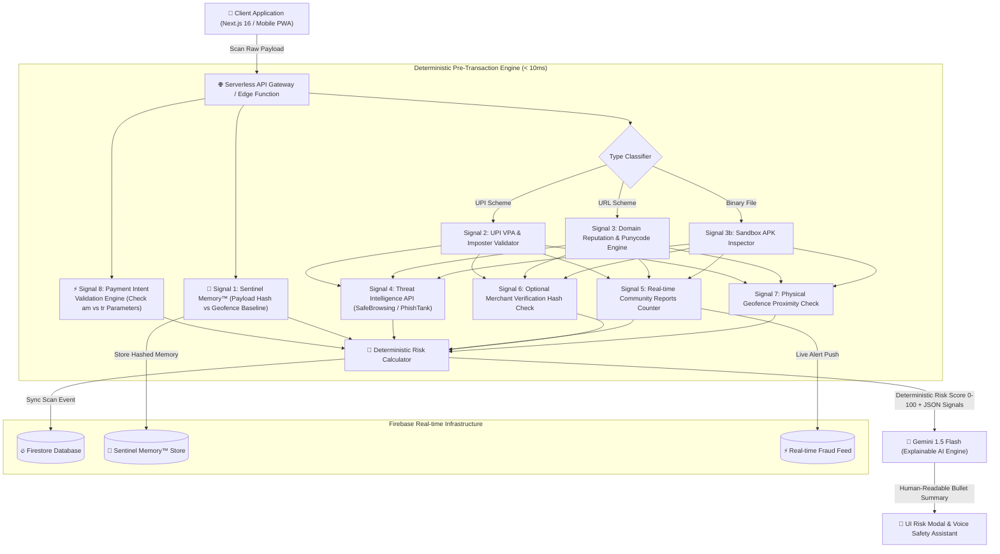

# 🏛️ SentinelQR — System Design Architecture & 16-Screen UI Wireframe Specification

> **Core Positioning**: SentinelQR is a **Pre-Transaction Payment Trust Engine** powered by **Sentinel Memory™** and the **Payment Intent Validation Engine** — evaluating *where* a payment goes and *how* the payment request is constructed before users authorize a transaction.

---

## 1. High-Level System Architecture (HLD)

SentinelQR adopts a **Sentinel Memory™ + Payment Intent Analysis + Strict Deterministic Core + Explainable AI (XAI)** architecture.

---

## 2. Multi-Signal Matrix (The 9 Core Signal Vectors)

| Signal | Category | Weight ($w_i$) | Description & Logic |
| :--- | :--- | :---: | :--- |
| **Signal 1** | **Sentinel Memory™** | Variable | Compares current payload SHA-256 hash with geofenced location memory. |
| **Signal 2** | **Sticker Replacement** | `+70` | Destination differs from location baseline $\rightarrow$ *"Potential QR replacement detected"*. |
| **Signal 3** | **Brand Impersonation** | `+40` | Levenshtein distance check on domain/VPA (e.g., `paytm-support@ybl`). |
| **Signal 4** | **Community Reports** | `+25..60` | Escalate score based on recent crowd-sourced fraud reports. |
| **Signal 5** | **Suspicious VPA Handle** | `+35` | Fraudulent keyword patterns (`refund`, `support`, `cashback`). |
| **Signal 6** | **URL Shorteners** | `+25` | Concealed redirect destination (`bit.ly`, `tinyurl`). |
| **Signal 7** | **Direct APK Download** | `+45` | Direct Android executable payload. |
| **⭐ Signal 8** | **Payment Intent Validation** | `+30` | Detects unexpected pre-filled amount (`am`) without dynamic transaction reference (`tr`). |
| **Signal 9** | **Explainable AI (XAI)** | Summary | Gemini 1.5 Flash translates JSON threat evidence into plain-English reasoning. |

---

## 3. Confidence-Based Risk Tiers

* **🟢 0 – 29 (LOW RISK)**: Destination matches historical trust pattern. Safe to proceed.
* **🟡 30 – 69 (SUSPICIOUS)**: Unexpected pre-filled amount or unverified handle detected. Caution required.
* **🔴 70 – 100 (CRITICAL DANGER)**: Potential QR replacement or phishing attempt detected. Do not proceed.
